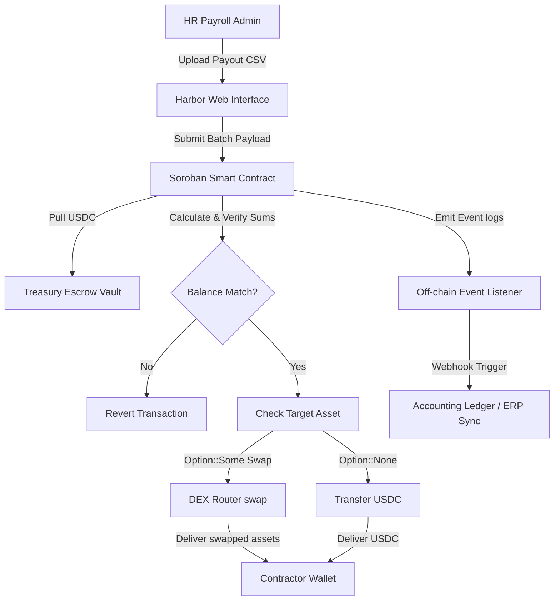

# Harbor // Borderless Freelancer & Agency Banking on Stellar

Harbor is a high-performance, enterprise-grade B2B batch payroll distribution protocol and cross-border bank routing routing gateway built for the Stellar network using Soroban smart contracts. 

The protocol is designed specifically to eliminate cross-border settlement latency, intermediary SWIFT wire charges, and currency conversion markups for remote contractors, freelancers, and global agencies operating in emerging markets (including the Philippines, Indonesia, Vietnam, and Nigeria).

---

## 🚀 Core Value Proposition & Mechanics

*   **Gas-Optimized Batch Routing:** Traditional on-chain payout loops are gas-intensive. Harbor leverages Soroban's optimized memory model to parse arrays, enabling an employer to fund a single batch transaction that distributes salaries to dozens of unique contractor wallets simultaneously.
*   **On-Chain DEX Path-Payments:** Harbor features a multi-asset swap router interface. If a contractor requests payouts in a non-USDC asset (e.g. native XLM or EURC), the contract automatically approves and routes the deposit through a DEX swap before transferring the funds.
*   **Anti-Frontrunning Reconciliation:** To prevent frontrunning or database out-of-sync exploits, the smart contract dynamically calculates array sums on-chain and verifies them against the submitted `declared_total`. If a parameter mismatch is detected, the transaction explicitly reverts.
*   **Sub-Ledger Accounting Logs:** Every individual payout emits a structured on-chain event (`payout_logged`) containing department codes and payee keys. Off-chain listener microservices subscribe to these events to reconcile ledger sheets (QuickBooks, Xero) in real time.

---

## 🗺️ Architectural Workflow



---

## 📂 Repository Structure

```text
harbor/
├── contracts/
│   └── hedgepay_batch/         <-- Soroban smart contract package
│       ├── Cargo.toml          <-- Rust dependencies & package configurations
│       └── src/
│           ├── lib.rs          <-- Core batch contract logic (USDC routing, DEX swaps)
│           └── test.rs         <-- Mock DEX router and adversarial test suite
├── listener/
│   ├── index.js                <-- Node.js Stellar event subscription microservice
│   └── package.json
├── src/
│   ├── app/                    <-- Next.js layout, routing, and UI dashboard screens
│   │   ├── dashboard/          <-- Overview page with transaction simulation sandbox
│   │   ├── ledger/             <-- Audit logs with StellarExplorer links
│   │   ├── recipients/         <-- Contractor registry database
│   │   ├── settings/           <-- Profile coordinates, API keys, and confirmation modals
│   │   └── vaults/             <-- Draggable split allocator and APY ticking widgets
│   └── components/             <-- Shared components (CSV upload logic, tables)
├── CONTRIBUTING.md             <-- Developer setup guidelines & FOSS Wave issues
├── FUNDING.json                <-- Stellar FOSS verify configuration file
├── Cargo.toml                  <-- Root Cargo workspace configuration
└── README.md                   <-- Main project documentation
```


## 🛠️ Local Developer Setup

### Prerequisites
*   **Rust & Cargo:** Install the latest stable Rust toolchain.
*   **Soroban target:** Add the WebAssembly target:
    ```bash
    rustup target add wasm32-unknown-unknown
    ```
*   **Node.js:** Ensure Node.js (v18+) is installed.

### 1. Building the Smart Contract
Navigate to the contract directory and build the bytecode:
```bash
cd contracts/hedgepay_batch
cargo build --target wasm32-unknown-unknown --release
```
The compiled output will be written to `target/wasm32-unknown-unknown/release/hedgepay_batch.wasm`.

### 2. Launching the Web Interface
From the root directory, install npm dependencies and launch the dev server:
```bash
npm install
npm run dev
```
Open **[http://localhost:3000](http://localhost:3000)** in your browser to interact with the dashboard.

---

## 🗳️ Open Source Contribution & Drips Waves

Harbor is proudly participating as an active project in the **Stellar Drips Wave Program**. 
*   To start contributing, review our setup instructions, coding conventions, and PR workflow in our **[Contribution Guidelines (CONTRIBUTING.md)](file:///c:/Users/olamide/Desktop/Hedgepay/CONTRIBUTING.md)**.
*   View our active issue backlog listed in `CONTRIBUTING.md` to claim tasks (ranging from Trivial React styling fixes to High-complexity Multi-Sig smart contract implementations) and earn USDC rewards.

